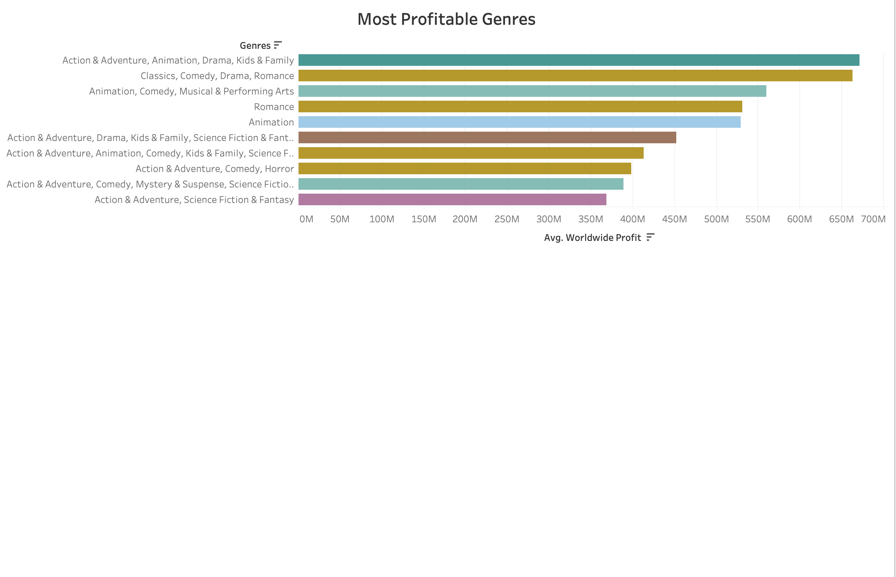
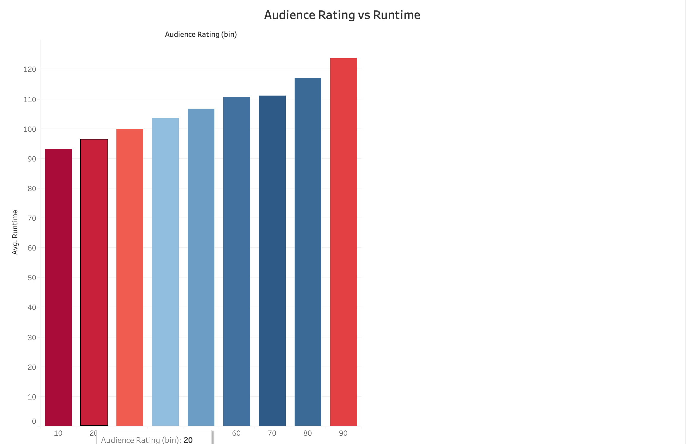
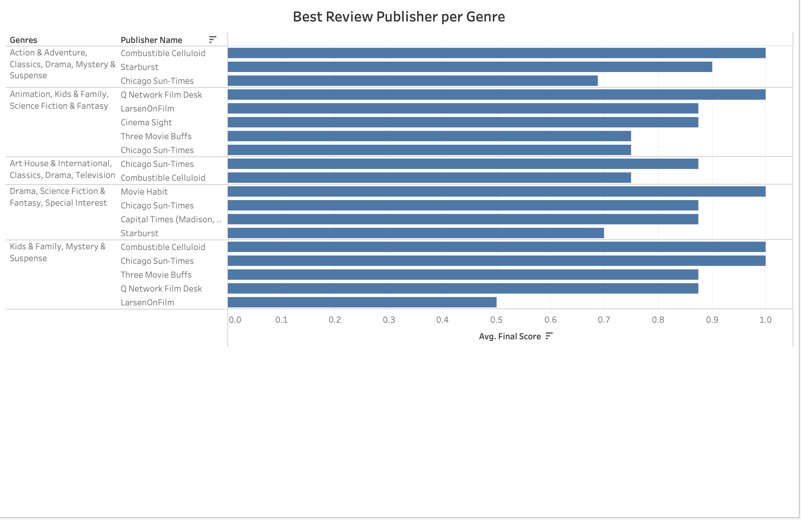

# Movie Type Analysis

**Author**: Todd Strain

## Overview
Virtucon has decided to enter the movie production business. The company needs to gain knowledge about which type of film does best at the box office.  We also tried to shed some light on less obvious area of the movie production process to give our studio a helping had in success.

To answer these queries we've gather data from 5 data sets with over 70K movies. We've focused on 1100 movies, for which all data was available. These movies were produced from 2010 to 2018 and covered 29 genres.

Our analysis shows that the most profitable movies are of the genre Action and Adventure, with sub genres of Science Fition & Fantasy, or Mystery and Suspence. An honarable metion should go to the genre Animation, Comedy, Kids & Family which landed 3 films in the top 15. An analysis of movie runtimes show that movies which run 120 minutes have the highest audience ratings. An anlysis of movie revie publishers shows that Cinimea Sight gives the most favourable revies for action movies.

## Business Problem
Virtucon wants to enter the movie production space but they do not have expertise in creating movies. Specifically they want to understand which types of movies do best at the box office.

## Data
We used five data sets from four sources for our analysis. The Box Office Mojo dataset contains several sections reporting box office receipts by time period and area. The IMDB dataset inludes movies, TV and entertainment programs and cast and crew members. Rotten Tomato provded two datasets; movie data and critics' review data. Lastly we use The Numbers Movie Budget and Financial Performance Records dataset.

## Methods
The biggest hurdle in this project was the poor quality of the data. Each of the five datasets was quite disorganized, so we had to spend extra time cleaning them up. Since each dataset contained important information, we decided to combine them into one large set. During this process, we removed any duplicate or unnecessary information. Next, we figured out the profit for each film by subtracting its production costs from its total earnings. We then ranked the movies by profit within each genre to identify the most profitable genres. To figure out the ideal movie length, we looked at user ratings and calculated the average runtime of the highest-rated movies. Finally, finding the publication with the best reviews was tricky because different publications used different scoring systems. We first converted all the review scores to a common scale. Once the scores were consistent, we could calculate the average review score for each publication.

## Results
Results show the most profitable movies are of the genre Action and Adventure. Movies of the genre Animation, Comedy, Kids & Family are also very successful. An analysis of movie runtimes show that audiences rate movies that are a few minutes over two hours long are the best. An anlysis of movie revie publishers shows that Cinimea Sight gives the most favourable revies for action movies.

## Repository Structure

|---README.md -----------------------> This document   
|---Movie-Type-Analysis.ipynb -------> Jupyter Notebook with data analysis 
|---notebook.pdf --------------------> PDF of Jupyter Notebook 
|---images --------------------------> Images used in this projet 
|---zippedData ----------------------> Folder with data files used for analysis   
|---presentation.pdf ----------------> PDF of presentation slides 
|---github.pdf ----------------------> PDF of this github page 

## Presentation
https://github.com/tstrain199/movie-type-analysis/blob/5c8da2c4a6bce50f8d500f6cd3ed6f213d375077/presentation.pdf

## Images
Combined Normalized Flight Saftey and Emmissions Ratings

